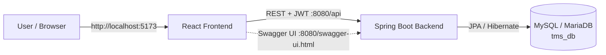

# Tailor Management System (TMS)

> A full-stack web application for managing a tailor shop end-to-end — customer
> measurement profiles, order intake, tailoring, invoicing, payment, and
> delivery — backed by a Spring Boot REST API and a modern React frontend.

---

## Table of Contents

- [Overview](#overview)
- [Features](#features)
- [Tech Stack](#tech-stack)
- [Architecture](#architecture)
- [Demo Accounts](#demo-accounts)
- [Prerequisites](#prerequisites)
- [Quick Start (one command)](#quick-start-one-command)
- [Manual Start (backend & frontend)](#manual-start-backend--frontend)
- [Stop the Application](#stop-the-application)
- [Database Setup](#database-setup)
- [Seeding Behavior](#seeding-behavior)
- [Running Tests](#running-tests)
- [API Documentation](#api-documentation)
- [Project Structure](#project-structure)
- [Environment Variables](#environment-variables)
- [Troubleshooting](#troubleshooting)

---

## Overview

TMS lets a tailor shop keep every stage of an order in one place:

1. A **customer** places an order (with reference images) and provides their
   measurement profile.
2. An **admin** reviews the order and assigns a **tailor**.
3. The **tailor** submits a price estimate.
4. A **cashier** generates and marks invoices as paid.
5. A **delivery** agent handles pick-up / drop-off and closes the order.

The frontend authenticates with a JWT issued by the backend; each role sees a
dashboard tailored to their responsibilities.

## Features

- Role-based authentication & authorization (`ADMIN`, `TAILOR`, `CASHIER`,
  `DELIVERY`, `CUSTOMER`) using stateless JWT.
- Customer measurement profiles (CNIC, lengths, collar, shalwar, pockets, …).
- Order lifecycle with status tracking:
  `PENDING_REVIEW → ESTIMATED → INVOICED → PAID → IN_PROGRESS →
  READY_FOR_DELIVERY → OUT_FOR_DELIVERY → DELIVERED`.
- Image uploads for order reference photos (served from `./uploads`).
- Invoice generation, payment recording, and feedback / ratings.
- Automatic database schema creation and initial account seeding.
- Swagger UI for interactive API exploration.

## Tech Stack

| Layer      | Technology                                                            |
| ---------- | --------------------------------------------------------------------- |
| Backend    | Java 17 · Spring Boot 3.5 · Spring Data JPA · Spring Security (JWT)    |
| Database   | MySQL / MariaDB 10.11 (JDBC: `mysql-connector-j`)                     |
| Frontend   | React 19 · Vite 8 · React Router 7 · Axios · Tailwind CSS 4            |
| Build      | Maven (`mvnw`) · npm                                                  |
| Testing    | JUnit 5 · MockMvc · Spring Security Test (in-memory H2)               |

## Architecture



- **Frontend** — `frontend/` (Vite dev server on port **5173**).
- **Backend** — `backend/` (Spring Boot on port **8080**, REST under `/api`).
- **Database** — a `tms_db` schema inside your local **MariaDB/MySQL** server.

## Demo Accounts

On first startup the backend seeds five demo accounts (each with password `123456`):

| Role     | Email               | Password |
| -------- | ------------------- | -------- |
| Admin    | `admin@gmail.com`   | `123456` |
| Tailor   | `tailor@gmail.com`  | `123456` |
| Cashier  | `cashier@gmail.com` | `123456` |
| Delivery | `delivery@gmail.com`| `123456` |
| Customer | `customer@gmail.com`| `123456` |

> Passwords are stored **BCrypt-hashed**. Seeding is idempotent — accounts are
> only created if their email is not already present, so restarts never reset
> or duplicate data. See [Seeding Behavior](#seeding-behavior).

## Prerequisites

| Tool          | Version   | Check          | Install (Ubuntu)                                        |
| ------------- | --------- | -------------- | -------------------------------------------------------- |
| OpenJDK       | 17+       | `java -version`| `sudo apt install openjdk-17-jdk`                         |
| Node.js + npm | 18+       | `node -v`      | `curl -fsSL https://deb.nodesource.com/setup_20.x \| sudo -E bash - && sudo apt install -y nodejs` |
| MySQL/MariaDB | 10.11+    | `mysql -V`     | `sudo apt install mariadb-server`                        |
| Maven         | — (bundled) | `./mvnw -v`   | Included via the Maven Wrapper — no separate install     |

## Quick Start (one command)

```bash
cd ~/Desktop/TMS
chmod +x start.sh stop.sh     # first time only
./start.sh
```

`start.sh` will:

1. Check Java / Node / MySQL are available (starting the DB service if needed).
2. Ensure the `root` password is `123456` and the `tms_db` database exists.
3. Build the backend jar (`target/tms-backend-*.jar`) and launch it on `:8080`.
4. Install frontend dependencies if needed and launch Vite on `:5173`.
5. Wait for both servers to respond, then print the URLs and demo accounts.

Open **[http://localhost:5173](http://localhost:5173)** to use the app.

Stop everything with `./stop.sh`.

## Manual Start (backend & frontend)

### 1. Backend

```bash
cd ~/Desktop/TMS/backend
./mvnw spring-boot:run
```

Wait for `Started TailorManagementSystemApplication`. API is then live at
[http://localhost:8080/api](http://localhost:8080/api).

### 2. Frontend

In a **second terminal**:

```bash
cd ~/Desktop/TMS/frontend
npm install      # only needed the first time
npm run dev
```

Vite prints the dev URL (normally **http://localhost:5173**).

> The frontend talks to the backend via `http://localhost:8080/api`, already
> configured in `frontend/src/services/api.js` (override with the
> `VITE_API_URL` environment variable).

## Stop the Application

```bash
cd ~/Desktop/TMS
./stop.sh
```

This kills the backend and frontend processes recorded in `.run/` and also
frees ports `8080` and `5173` if any stray process is still bound to them.

## Database Setup

The backend already connects to **`tms_db`** with `root` / `123456` (see
`backend/src/main/resources/application.properties`), and the JDBC URL includes
`createDatabaseIfNotExist=true`, so the schema is created automatically.

If you want to create the database manually:

```bash
# 1. Set the root password once (if not already 123456)
echo '123456' | sudo -S mysql -u root \
  -e "ALTER USER 'root'@'localhost' IDENTIFIED BY '123456'; FLUSH PRIVILEGES;"

# 2. Create the database
echo '123456' | sudo -S mysql -u root \
  -e "CREATE DATABASE IF NOT EXISTS tms_db CHARACTER SET utf8mb4 COLLATE utf8mb4_unicode_ci;"

# 3. Verify
mysql -u root -p123456 -h 127.0.0.1 -e "SHOW DATABASES LIKE 'tms_db';"
```

Key settings in `application.properties`:

```properties
spring.datasource.url=jdbc:mysql://localhost:3306/tms_db?createDatabaseIfNotExist=true&useSSL=false&allowPublicKeyRetrieval=true&serverTimezone=UTC
spring.datasource.username=root
spring.datasource.password=123456
spring.jpa.hibernate.ddl-auto=update
spring.jpa.show-sql=true
```

## Seeding Behavior

- `DataSeeder` (`backend/src/main/java/com/amdevelopers/tms/config/DataSeeder.java`)
  runs on application startup.
- For each of the five roles it inserts the account **only if** that email does
  not already exist (`UserRepository.existsByEmail`).
- Passwords are hashed with Spring Security's `BCryptPasswordEncoder` before
  saving.
- The seeded **username equals the email**, which is why you sign in with the
  email address.
- The customer account also receives an empty `CustomerProfile` so
  customer endpoints work immediately.
- All seed values are overridable via the `app.seed.*` properties or the
  `ADMIN_PASSWORD`, `TAILOR_PASSWORD`, `CASHIER_PASSWORD`,
  `DELIVERY_PASSWORD`, `CUSTOMER_PASSWORD` environment variables.

## Running Tests

Backend tests use an in-memory H2 database (no MySQL needed):

```bash
cd ~/Desktop/TMS/backend
./mvnw test
```

Frontend build check:

```bash
cd ~/Desktop/TMS/frontend
npm run build
```

## API Documentation

With the backend running, browse interactive Swagger/OpenAPI docs at:

- **Swagger UI:** http://localhost:8080/swagger-ui.html
- **OpenAPI JSON:** http://localhost:8080/v3/api-docs

## Project Structure

```
TMS/
├── backend/                        # Spring Boot REST API
│   ├── src/main/java/com/amdevelopers/tms/
│   │   ├── config/                 # DataSeeder, WebConfig (CORS)
│   │   ├── controller/             # REST controllers
│   │   ├── dto/                    # Request/response payloads
│   │   ├── entity/                 # JPA entities (User, Order, Invoice, …)
│   │   ├── enums/                  # Role, OrderStatus, PaymentStatus
│   │   ├── exceptions/             # Global exception handling
│   │   ├── repositories/           # Spring Data JPA repositories
│   │   ├── security/               # JWT filter, config, user details
│   │   └── services/               # Business logic
│   ├── src/main/resources/application.properties
│   └── pom.xml
├── frontend/                       # React + Vite + Tailwind CSS
│   ├── src/
│   │   ├── components/             # Sidebar, Navbar, Modal, StatusBadge, …
│   │   ├── context/                # AuthContext (JWT session)
│   │   ├── pages/                  # Login, Register, role dashboards
│   │   ├── services/api.js         # Axios instance + interceptors
│   │   ├── utils/format.js         # Money/date formatters
│   │   ├── App.jsx                 # Route definitions
│   │   └── main.jsx
│   ├── index.html
│   └── package.json
├── start.sh                        # One-command run script
├── stop.sh                         # One-command stop script
└── screenshots/
```

## Environment Variables

| Variable                 | Default                      | Purpose                                  |
| ------------------------ | ---------------------------- | ---------------------------------------- |
| `VITE_API_URL`           | `http://localhost:8080/api`  | Backend base URL for the frontend        |
| `JWT_SECRET`             | (bundled dev secret)         | HS512 secret for signing JWTs            |
| `JWT_EXPIRATION_MS`      | `86400000`                   | JWT lifetime in milliseconds (24 h)      |
| `ADMIN_PASSWORD`         | `123456`                     | Seed password for `admin@gmail.com`      |
| `TAILOR_PASSWORD`        | `123456`                     | Seed password for `tailor@gmail.com`     |
| `CASHIER_PASSWORD`       | `123456`                     | Seed password for `cashier@gmail.com`    |
| `DELIVERY_PASSWORD`      | `123456`                     | Seed password for `delivery@gmail.com`   |
| `CUSTOMER_PASSWORD`      | `123456`                     | Seed password for `customer@gmail.com`   |
| `UPLOAD_DIR`             | `./uploads`                  | Directory for uploaded reference images  |

## Troubleshooting

**Port 8080 is already in use**
Something else is bound to 8080. Find and stop it, then re-run:

```bash
ss -ltnp | grep ':8080'        # shows the offending PID
kill <PID>
```

**Port 5173 is already in use**
Vite picks the next free port automatically; set a fixed one with
`npm run dev -- --port 5173`. Or stop the other dev server.

**`Access denied for user 'root'@'localhost'` from the backend**
Ensure the root password is `123456`:

```bash
echo '123456' | sudo -S mysql -u root -e "ALTER USER 'root'@'localhost' IDENTIFIED BY '123456'; FLUSH PRIVILEGES;"
```

**Database not starting in `start.sh`**
Ensure the MariaDB/MySQL service is enabled and running:

```bash
sudo systemctl enable --now mysql      # or: mariadb
```

**Backend tests fail on a fresh checkout**
Tests use H2 only; install JDK 17+ and run `./mvnw test` — no database needed.

**A seed account is missing after a restart**
Seeding is skip-if-exists. To force a clean reseed, drop only the seeded rows
(or recreate the database):

```bash
mysql -u root -p123456 tms_db -e "DELETE FROM users;"
```